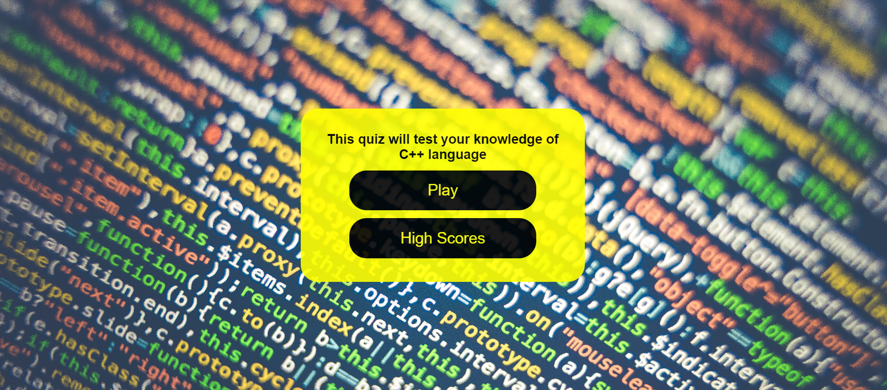
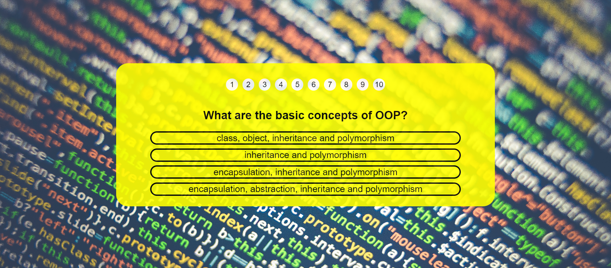
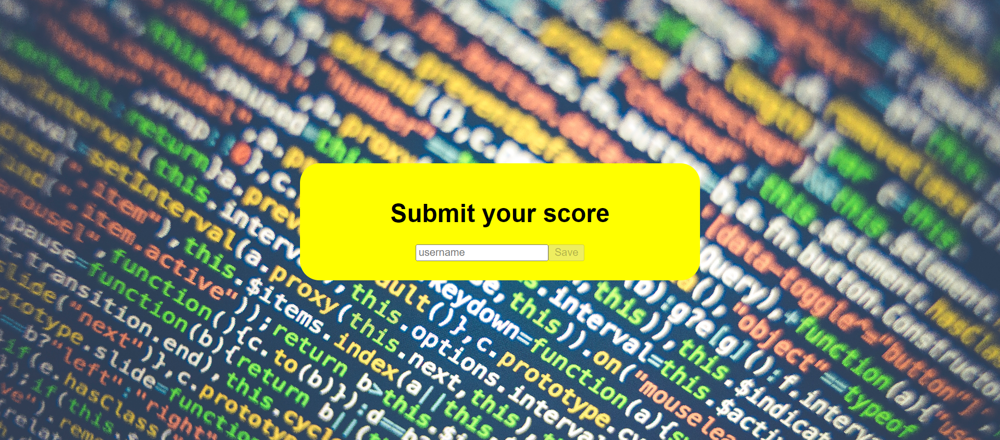
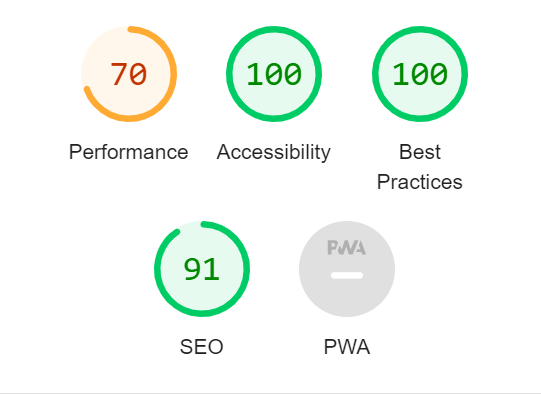

# C++ Quiz
There are different topics for a quiz, but all of them have the same target. To test your knowledge in a specific area. The purpose of this C++ Quiz is to test how well you know coding. It has 10 questions that, in my opinion, is enough to test various coding skills. The quiz consists of five pages:
- Welcome home page
- Questions and answers game page
- Submit page
- High scores page to check your score

  

## Website intentions
- To estimate how well you know C++
- To keep people learning programming

## Creation Process
- Strategy
  - THe audience of the web site is mainly people who have some coding experience and just want to know how well they know C++.
- Scope
  - It has four pages and have features like links to another pages, forms and lists. All pages have a frame which contains the content.
- Structure
  - The home page has two links. One for the game page and the other one to high scores page. Game page is the main page of the whole quiz. It contains questions and answers. After you finish appears the end page with submission form where you can save your progress.

## Page features
- Home page
  - The page has only two black links which look like buttons in a yellow frame. The header is here to welcome you and give general information about the quiz.

  

- Game page
  - This is the main page of the whole game. It has question circles which change their color depend on your answer, the question and choices are taken from a javascript object. If your answer was wrong appearing alert to inform you which answer is right. After you complete the quiz you see congratulation message.

  

- Submit page
  - This page is needed only to submit your score. The form has two elements. Text field for your name and a button which is disabled till you enter your name. After that you get to home page where you can start the game again or view the list of high scores.

  

- High scores page
  - On this page you can find top five players. It has a header, ordered list with player's name and score and button to return to home page.

  

## Design changes
At the begining I didn't plan to have a background image, but without it web site looked poor, so that I added one related to coding topic. Later I added some javascript features like alert, when you give wrong answer. The answer changes border color (red or green).

## Future features
To make it look nicer, when you wait for loading new question, I want to add CSS/Javascript dots loader and 3D effects to buttons as well.

## Validator testing
- HTML
  - No errors were returned when passing through the official W3C validator.
- CSS
  - No errors were found when passing through the official (Jigsaw) validator.
- Accessibility
  - I confirmed that the colors and fonts chosen are easy to read and accessible by running through lighthouse in devtools.

  

## Personal testing
- The website was created and tested on Google Chrome and Microsoft Edge and works as expected. For testing on mobiles I used the Google Dev Tools. I haven't noteced any existing bugs.

## Deployment
- The project was deployed to GitHub pages. The steps to deploy are as follows:
  - In the GitHub repository navigate to the Settings tab.
  - From the source section drop-down menu select the Master Branch.
  - Once the master branch has been selected the page provided the link to the completed website.

## Credits
- Content
  - The content of the quiz was developed by me. All questions are based on my knowledge of C++ language.
- Media
    - Background image was found on [Pexels](https://www.pexels.com/).
- Code
    - Code for [high-scores](https://www.youtube.com/watch?v=jfOv18lCMmw&t=17s&ab_channel=JamesQQuick) and [end](https://www.youtube.com/watch?v=DFhmNLKwwGw&ab_channel=JamesQQuick) pages was taken from the videos.